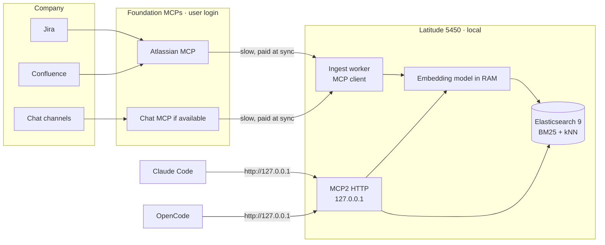
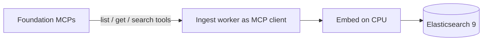
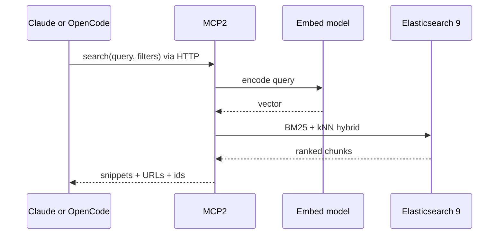
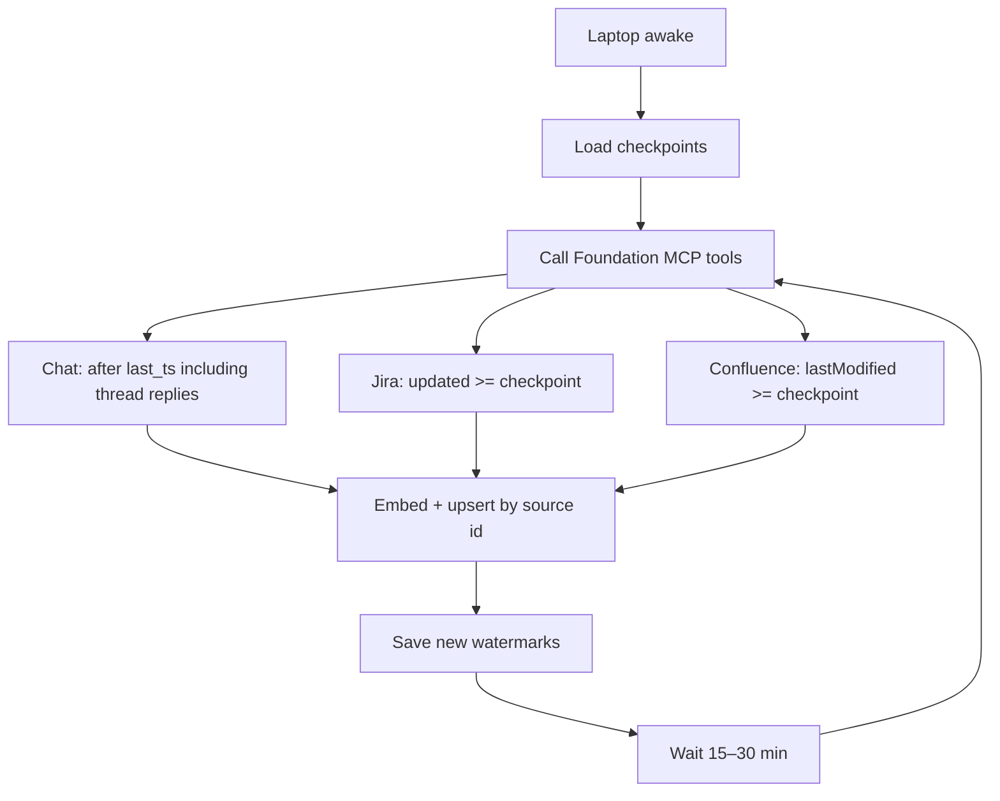

# Local retrieval index

Laptop-only cache of team chat, Jira, and Confluence. Not deployed. On the company PC the clients are **Claude Code** and **OpenCode**, not Cursor. Open this file in markdown preview to render the diagrams.

**Verdict:** ingest via Foundation MCPs (your user). Store in **Elasticsearch 9**. Serve retrieval as MCP2 on `127.0.0.1` (Streamable HTTP) so Claude and OpenCode share one process and one embedding model.

## System

Two MCP layers, different jobs:

| Layer | Role | When |
| --- | --- | --- |
| Foundation MCPs | Read Jira / Confluence / chat as **you** | Backfill and incremental sync only |
| MCP2 on localhost | Semantic search over Elasticsearch 9 | Every question in Claude or OpenCode |

Cursor is not a runtime client on the company PC. It can still be used elsewhere to edit this repo.

## Why HTTP, not stdio

Claude and OpenCode both speak MCP. If MCP2 were stdio, each app would spawn its own server and load the embedding model twice.

One Python process on `127.0.0.1` (Streamable HTTP):

- One model in RAM
- One connection to Elasticsearch 9
- Both tools attach with the same URL
- Bind localhost only — company data does not leave the notebook

Example shape (not the final config):

- Claude Code: HTTP MCP URL `http://127.0.0.1:8765/mcp`
- OpenCode: same URL in its MCP config

## Ingest path

No personal API tokens. Ingest is a client of the same Foundation MCPs you already use in Claude/OpenCode. Lag stays on this path: overnight backfill, not every query.

MCPs are built for “find this issue”, not “dump 12 months”. Paginate, checkpoint, sleep.

Foundation login inside Claude/OpenCode does **not** automatically transfer to the ingest process. The worker must authenticate those MCPs on its own, the way Foundation documents.

## Query path

After the index exists, Claude/OpenCode should **not** call Foundation MCPs for this retrieval.

## Incremental updates

No webhooks. If the lid is closed, the next run resumes from the last watermark.

## Runtime on this machine

| Piece | Choice |
| --- | --- |
| Language | Python 3.12 |
| Ingest | MCP **client** against Foundation servers |
| Index | **Elasticsearch 9.5.x** in Docker, 2 GB heap, single node, `elasticsearch-py` 9.x |
| Vectors | `dense_vector` + hybrid BM25 / kNN. ES 9 will quantize 384-d vectors (BBQ/int8 HNSW); that is fine on 32 GB |
| Embeddings | Generated in Python (`bge-small` or `multilingual-e5-small`). Do not use Elastic hosted inference |
| MCP2 | Streamable HTTP on `127.0.0.1` for Claude Code and OpenCode |
| Peak extra RAM | about 6 GB on top of Claude/OpenCode |

Do not also run a local 7B chat model. Claude/OpenCode already generate the answer.

## MCP2 tools

- `search` — hybrid retrieval with optional source/channel/date filters
- `thread` — full chat thread for a hit
- `issue` — Jira issue plus comments
- `page` — Confluence page sections around a hit

## First practical step

List the tools each Foundation MCP exposes (`list_tools`). Ingest can only pull what those tools allow. If there is no chat MCP, chat is out of scope until Foundation adds one.
